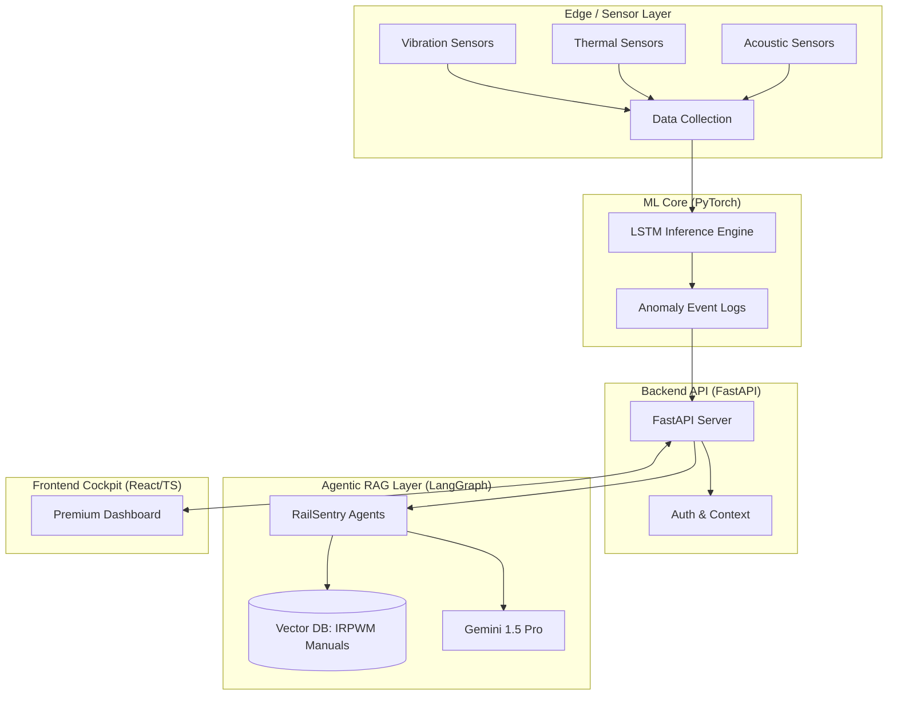
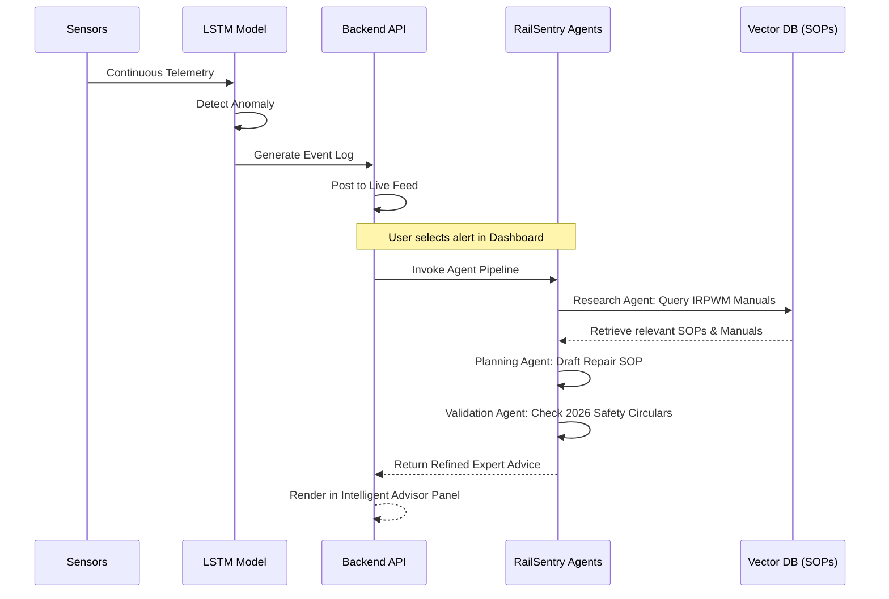

# 📡 RailSentry AI: Next-Gen Railway Asset Guardian

**RailSentry AI** is a premium, industry-grade intelligent system designed to monitor Indian Railway assets using Machine Learning and provide expert maintenance consultancy through an Agentic RAG (Retrieval-Augmented Generation) system.

## 🚀 Overview

The project addresses critical railway safety priorities by:
1.  **Predicting Failures**: Using a trained LSTM model to detect anomalies (vibration, heat, wear) in real-time.
2.  **Reasoning with Expertise**: A multi-agent system (Gemini 1.5 Pro) that consults IRPWM safety manuals and SOPs.
3.  **Elite Dashboarding**: A high-fidelity, corporate-aesthetic cockpit built with **React, TypeScript, and Framer Motion**.

---

## 🏗️ System Architecture



---

## 🔄 Operation Workflow

When an anomaly is detected, the **RailSentry AI** advisor follows this orchestrated path:



---

## 🛠️ Key Features

- **Deep Space UI**: A premium dark-theme interface with custom glassmorphism and ambient glowing accents.
- **24-Hour Telemetry**: Real-time visualization of vibration, axle temperature, and bearing wear.
- **Segment Health Index**: Real-time status monitoring of structural integrity across geographical zones.
- **Agentic Pipeline**: Multi-step reasoning (Ingestion → Research → Planning → Validation) for safe maintenance.

---

## 🚦 Getting Started

### 1. Backend Setup
```powershell
# Root Directory
python -m venv venv
.\venv\Scripts\activate
pip install -r requirements.txt
# Set your Gemini API Key
$env:GOOGLE_API_KEY = "your_key"
python backend/main.py
```

### 2. Frontend Setup
```powershell
cd frontend
npm install
npm run dev
```

---

## 📂 Project Structure

```text
├── backend/               # FastAPI API Layer
├── frontend/              # Premium React + TypeScript Dashboard
├── rag/                   # Agentic RAG System
│   ├── agents/            # Multi-Agent Workflow Core
│   └── vector_db/         # FAISS Index of Technical Manuals
├── ml/                    # Machine Learning Pipeline
│   ├── models/            # LSTM Model Weights
│   └── inference.py       # Live Data Stream Simulation
└── data/                  # Source manuals and generated logs
```
